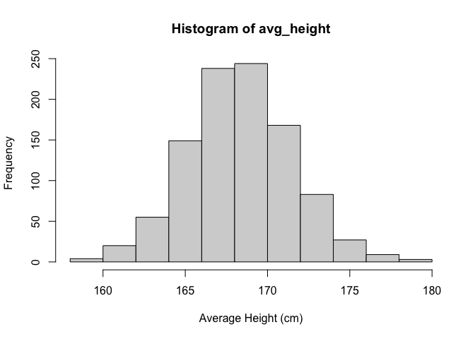
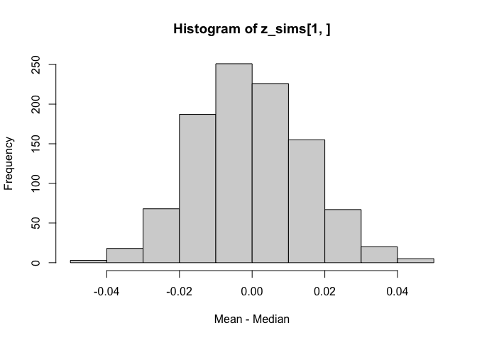
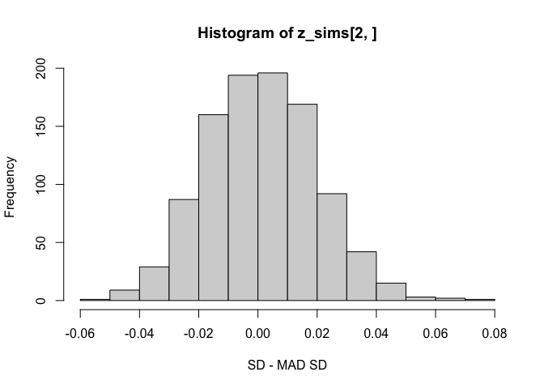

```r
library(here)
library(tidyverse)
# library(brms)
# options(mc.cores = 4)
# options(brms.backend = "cmdstanr")
```

## Simulation of discrete probability models


```r
height_sim <- function(N){
  male <- rbinom(N, 1, 0.48)
  height <- ifelse(male==1, rnorm(N, 69.1*2.54, 2.9*2.54), rnorm(N, 63.7*2.54, 2.7*2.54))
  mean(height)
}
```


```r
avg_height <- replicate(1000, height_sim(N=10))
hist(avg_height, xlab = "Average Height (cm)")
```

<!-- -->

## Summarizing a set of simulations using median and median absolute deviation


```r
z <- rnorm(1e4, 5, 2)
cat("mean =", mean(z), ", median =", median(z), ", sd =", sd(z), ", mad sd =", mad(z))
```

```
## mean = 4.997056 , median = 4.992674 , sd = 1.997732 , mad sd = 2.022879
```

### Simulate this


```r
mad_sim <- function(){
  z <- rnorm(1e4, 5, 2)
  mean_med = mean(z) - median(z)
  sd_mad = sd(z) - mad(z)
  c(
    mean_med,
    sd_mad
  )
}
```


```r
z_sims <- replicate(1000, mad_sim())
hist(z_sims[1,], xlab = "Mean - Median")
```

<!-- -->

```r
hist(z_sims[2,], xlab = "SD - MAD SD")
```

<!-- -->

