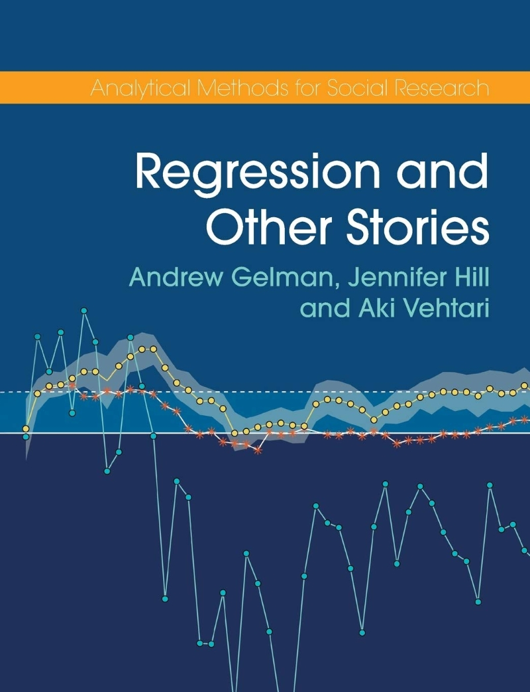
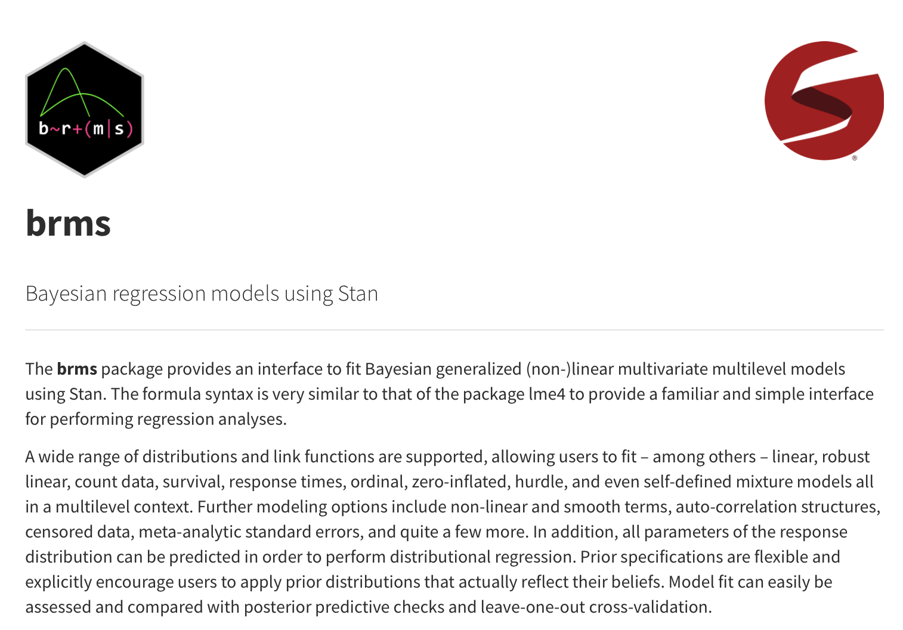

<!-- background-image: url("./figs/reproduction.png") -->
<!-- background-position: 50% 40% -->
<!-- background-size: 70% -->


```{r setup, include=FALSE}
options(htmltools.dir.version = FALSE)
knitr::opts_chunk$set(
  echo = TRUE, 
  fig.align = 'center'
  )
```

```{r xaringan-themer, include=FALSE, warning=FALSE}
library(xaringanthemer)
style_mono_accent(base_color = "#17416A") # color for ROS cover
```

## Material

```{r title_page, echo=FALSE, out.width="50%"}

```

---

## Schedule

- Two chapters per week

- In total, 11 weeks to finish the book

- We agreed to *at least* copy & paste and run the code

---

## Prerequisite (My recommendation)

- [Data and Code](https://avehtari.github.io/ROS-Examples/examples.html)
 
- Install `R`

- Install `brms`

- Setup `Rstudio Project`

- Setup `rmarkdown`

---

## What is `brms`?

- It helps you easily implement Bayesian regression models using `lmer` syntax

- https://paul-buerkner.github.io/brms/

```{r brms, echo=FALSE, out.width="80%"}

```

---

## What is `Rstudio Project`?

- It helps you handle path problems easier, inside a single folder

- You can create a `R project` from the Rstudio menu `File -> New Project`.

- https://r4ds.had.co.nz/workflow-projects.html

---

## What is `rmarkdown`?

- You can embed code chunks (of R or other languages) in Markdown documents

- For later you!

- https://bookdown.org/yihui/rmarkdown/

- This slide is actually made with `rmarkdown` <br>(using additional `xaringan` package)</br>

---

## Helpful resources

**General Introduction to Statistics**
- [Statistical Thinking for the 21st Century](https://statsthinking21.github.io/statsthinking21-core-site/)
- [Learning Statistical Models Through Simulation in R](https://psyteachr.github.io/stat-models-v1/)

**Bayesian Inference**
- [An Introduction to Bayesian Data Analysis for Cognitive Science](https://vasishth.github.io/bayescogsci/book/)

**Data analysis books**
- [An Introduction to Data Analysis](https://michael-franke.github.io/intro-data-analysis/)
- By University of Glasgow School of Psychology: [PsyTeachR](https://psyteachr.github.io/)

**Cheat Sheet**
- [GLMM FAQ](http://bbolker.github.io/mixedmodels-misc/glmmFAQ.html) by Ben Bolker

- [Cross-validation FAQ](https://avehtari.github.io/modelselection/CV-FAQ.html) by Aki Vehtari

---

### If you are interested in Reproducible Research:

**Git**
- [Version Control with Git](https://swcarpentry.github.io/git-novice/)
- [How to Write a Git Commit Message](https://chris.beams.io/posts/git-commit/#end)
- [Curating Research Assets: A Tutorial on the Git Version Control System](https://psyarxiv.com/6tzh8/)
- [Happy Git and GitHub for the useR](https://happygitwithr.com/)

**R**
- [Packaging Data Analytical Work Reproducibly Using R (and Friends)](https://doi.org/10.1080/00031305.2017.1375986)
- [Reproducible Research in R](https://monashdatafluency.github.io/r-rep-res/)
- [Reproducible R Workflows for Research Papers](https://sysilviakim.com/2021-01-25-r-ladies-dallas-presentation-reproducible-r-workflows-for-research-papers/)

**Python**
- [A Collection of Reproducible Research Practices](https://mg.readthedocs.io/reproducible_research.html)
- [Cookiecutter Data Science](https://drivendata.github.io/cookiecutter-data-science/)
- [How to Start a Data Science Project in Python](https://godatadriven.com/blog/how-to-start-a-data-science-project-in-python/)

---

class: inverse center middle

# Any questions?
